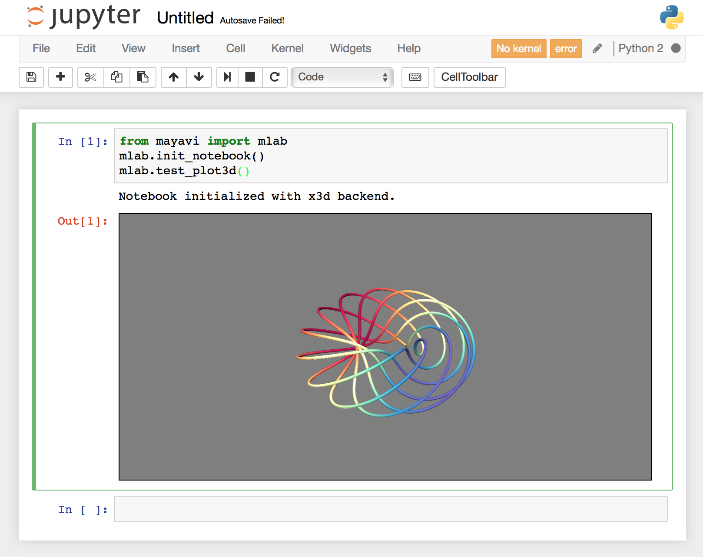

Plot with Mayavi in Jupyter notebook on Docker for Mac
===============================================================================
Last update: 14 January, 2017

1. Install `Docker for Mac <https://docs.docker.com/engine/installation/mac/>`_
2. Install `Xquartz <https://www.xquartz.org>`_
3. Install socat:

    .. code:: console

        $ brew install socat

4. Build docker image:

    .. code:: Dockerfile

        FROM jupyter/datascience-notebook
        MAINTAINER Taku Yoshioka <taku.yoshioka.4096@gmail.com>

        USER root

        RUN apt-get update && \
            apt-get install -y \
            libglu1-mesa

        RUN apt-get update && \
            apt-get install -y \
            libvtk5-dev

        RUN apt-get update && \
            apt-get install -y \
            mayavi2

        RUN rm /bin/sh && ln -s /bin/bash /bin/sh

        USER jovyan

        ENV LIBGL_ALWAYS_INDIRECT 1

        RUN source activate python2 && \
            conda install -y mayavi && \
            conda install -y -c conda-forge jupyter_contrib_nbextensions
        RUN source activate python2 && \
            jupyter nbextension install --py mayavi --user

    .. code:: console

        $ build -t jupyter-mayavi .

5. Set indirect GLX flag to be used for Xquartz

    .. code:: console

        $ defaults write org.macosforge.xquartz.X11 enable_iglx -bool true

    - `Hoffman2 Cluster User Guide <http://www.hoffman2.idre.ucla.edu/access/x11_forwarding/>`_

6. Run Xquartz

7. Run socat

    .. code:: console

        $ socat TCP-LISTEN:6000,reuseaddr,fork UNIX-CLIENT:\"$DISPLAY\"

8. Run docker container

    .. code:: console

        $ ip=$(ifconfig en0 | grep inet | awk '$1=="inet" {print $2}')
        $ docker run --rm -p 9000:8888 -e DISPLAY=$ip:0 --name test jupyter-mayavi

9. Launch a notebook with Python2 kernel

10. Run the following commands in the notebook:

    .. code:: python

        from mayavi import mlab
        mlab.init_notebook()
        mlab.test_plot3d()

